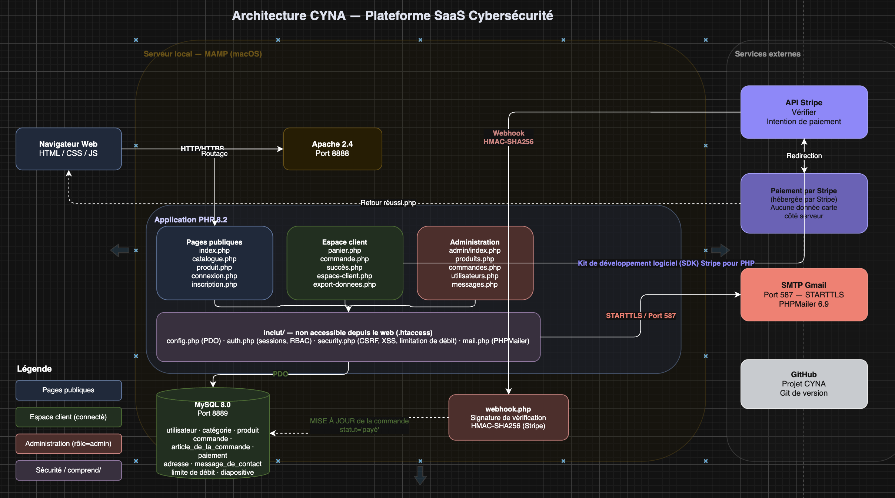
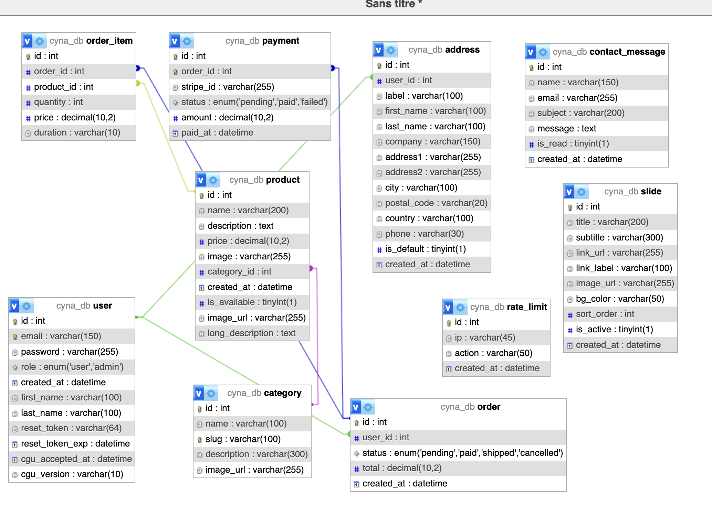
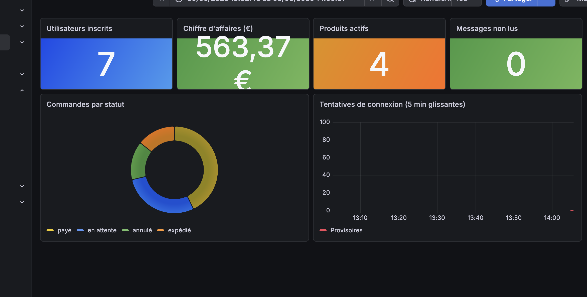

# DAT — Spécialité DEV Full Stack | Projet CYNA | CPI Bachelor INGETIS / SUP DE VINCI

---

**INGETIS / SUP DE VINCI — CPI BACHELOR RNCP 38478**
**SPÉCIALITÉ DÉVELOPPEMENT FULL STACK — B5**

# DOCUMENT D'ARCHITECTURE TECHNIQUE
## DAT — Épreuve certifiante BC3
### Superviser la mise en œuvre d'un projet informatique

| PROJET | SPÉCIALITÉ |
|---|---|
| CYNA — Cybersecurity SaaS (EDR / XDR / SOC) | ✅ DEV — Développement Full Stack (B5) |

| GROUPE / ÉQUIPE | DATE DE DÉPÔT FINAL |
|---|---|
| Groupe n° ___ \| Promo 2024–2025 | À définir par le responsable pédagogique |

**MEMBRES ET SECTIONS RÉDIGÉES**

Omar AKAKBA — Sections : P1, P2, P3, P4, P5, P6

Elyes JAFFEL — Sections : P2.1 (schéma architecture), Design System Front-End

> **RAPPEL BC3 : livrable collectif — chaque membre rédige ses sections identifiées — 100% de la note de BC3**
> Rendu : DAT (ce document) + Code GIT complet + Documentation technique + Guide d'installation

---

---

# MODE D'EMPLOI — GUIDE ÉTUDIANT & FORMATEUR

> Ce template est conçu pour être rempli progressivement d'avril à juin (module DAT, 21h).

**Contenu du Rendu Final BC3**

| Composant | Nature | Format | Localisation |
|---|---|---|---|
| Le DAT (ce document) | Collectif, sections individuelles identifiées | PDF + DOCX source | `docs/DAT_BC3_FINAL.docx` + `docs/DAT_BC3_CYNA.pdf` |
| Code source | Repository GIT avec historique complet de commits | URL GitHub | https://github.com/Omarakakba/CYNA-Project |
| Documentation API | Collection Postman (12 requêtes) + rendu HTML | JSON + HTML | `docs/postman_collection.json` + `docs/api_documentation.html` |
| Guide d'installation | Procédure déploiement reproductible from scratch | Markdown + PDF | `guide-installation/guide_installation.md` + `docs/guide_installation.pdf` |
| DCT et docs complémentaires | Schémas ERD + architecture, rapport tests PHPUnit, politique RGPD | PDF + ZIP | `docs/DCT_documents_complementaires.zip` |

> ⚠ **DAT ≠ Document de cadrage** — Le cadrage décrivait le PRÉVU. Le DAT décrit ce qui a été RÉELLEMENT implémenté.
> Le correcteur externe vérifiera la cohérence entre le DAT écrit et le code GIT déposé.

**Tableau de répartition des sections**

| Membre | Sections |
|---|---|
| Omar AKAKBA | P1.1, P1.2, P1.3, P2.2, P2.3, P2.4, P3.1, P3.2, P3.3, P3.4, P4.1, P4.2, P4.3, P5.1, P5.2, P5.3, P5.4, P6.1, P6.2, P6.3 |
| Elyes JAFFEL | P2.1 (schéma architecture globale), intégration Front-End |

---

---

# PARTIE 1 — VISION ET OBJECTIFS

*Fenêtre de rédaction : Avril — Semaines 1–2*

> **GUIDE FORMATEUR — P1**
> Vérifier que la vision est ancrée dans CYNA (SaaS Cyber) et non générique. Objectifs mesurables exigés.

## 1.1 Contexte CYNA

CYNA est une société fictive proposant des services EDR, XDR et SOC en mode SaaS. Votre équipe développe la plateforme complète : site vitrine public, espace client, backoffice admin et API REST. Décrivez les enjeux et les choix stratégiques.

**Contexte et enjeux métier — Rédacteur(s) : Omar AKAKBA**

La cybersécurité est devenue un enjeu critique pour les entreprises de toutes tailles. Face à la multiplication des cyberattaques (ransomware, phishing, intrusions), les PME et ETI n'ont souvent pas les ressources internes pour se protéger efficacement. CYNA répond à ce besoin en proposant des solutions SaaS de cybersécurité accessibles, gérées à distance et facturées par abonnement.

La plateforme commercialise trois offres phares :
- **EDR (Endpoint Detection & Response)** : détection comportementale en temps réel sur les postes de travail et serveurs
- **SOC Managé** : surveillance 24h/24 par des analystes certifiés avec SLA de détection < 5 minutes
- **VPN entreprise** : chiffrement AES-256, authentification MFA et architecture Zero Trust

L'enjeu technique principal est de construire une plateforme e-commerce B2B complète et sécurisée permettant à des responsables IT d'entreprise de souscrire, gérer et renouveler leurs abonnements. La plateforme doit être robuste face aux attaques (OWASP Top 10), conforme au RGPD et intégrer un système de paiement fiable via Stripe.

Le choix architectural retenu est **PHP natif sans framework**, contrainte pédagogique imposée et assumée, qui force une maîtrise complète des mécanismes de sécurité : sessions, CSRF, injection SQL, XSS, rate limiting — sans abstraction framework. Toute la logique métier est centralisée dans `includes/` (non accessible depuis le web), les données transitent uniquement via PDO avec requêtes préparées, et les secrets sont stockés dans un fichier `.env` exclu du versioning.

Le projet a été déployé en production sur **Alwaysdata** (https://omar05.alwaysdata.net/cyna/) et intègre une infrastructure DevOps complète : Docker Compose, pipeline GitHub Actions CI/CD, monitoring Prometheus + Grafana avec alertes email, et suite de tests PHPUnit avec 29 tests automatisés.

## 1.2 Vision architecturale

- Architecture PHP monolithique côté serveur (Server-Side Rendering) — choix justifié par la contrainte no-framework et la maîtrise totale de la sécurité
- Stratégie sécurité-first : chaque page protégée commence par `requireLogin()` ou `requireAdmin()`, CSRF sur tous les formulaires POST, `escape()` sur toutes les sorties HTML
- PHP natif justifié vs React/Node.js : adéquation au périmètre projet, maîtrise de l'équipe, déploiement Apache standard sans runtime supplémentaire
- Philosophie : séparation stricte includes/pages, aucune requête SQL hors `includes/`, variables d'environnement pour tous les secrets

**Vision et principes directeurs — Rédacteur(s) : Omar AKAKBA**

L'architecture retenue suit un modèle **MVC-like procédural** : les pages `.php` gèrent le routing et la présentation, `includes/` centralise toute la logique (auth, sécurité, BDD, mail). Ce découplage garantit qu'aucune logique métier sensible n'est exposée directement via le web (`.htaccess` bloque l'accès direct à `includes/`).

Les principes directeurs sont : code lisible et auditable, sécurité vérifiable ligne par ligne, zéro dépendance superflue, configuration externalisée. La plateforme est conteneurisée avec Docker pour garantir la reproductibilité, et un pipeline CI/CD GitHub Actions assure la non-régression automatique à chaque push.

## 1.3 Objectifs techniques

| Objectif | Indicateur de succès | Priorité |
|---|---|---|
| Performance pages ≤ 500ms | Mesure navigateur / curl | Haute |
| Couverture tests automatisés | 29 tests PHPUnit passants | Haute |
| Authentification sécurisée | Aucun accès non autorisé en recette | Critique |
| Pipeline CI/CD fonctionnel | Workflow GitHub Actions vert sur main | Moyenne |
| Documentation API complète | Collection Postman exportée | Moyenne |
| Monitoring temps réel | Dashboard Grafana + alertes email | Moyenne |
| Déploiement reproductible | `docker compose up` < 15 min | Haute |
| Conformité RGPD | Art. 7, 17, 20 implémentés et testés | Critique |

---

---

# PARTIE 2 — ARCHITECTURE TECHNIQUE

*Fenêtre de rédaction : Avril — Semaines 2–3*

> **GUIDE FORMATEUR — P2**
> Exiger : schéma archi globale (SPA/API/BDD) + diagramme flux + ERD. Justifications techno obligatoires.

## 2.1 Schéma d'architecture globale

Le schéma doit représenter : application PHP, MySQL, services tiers (Stripe, email…) et leurs interfaces de communication.

**Schéma d'architecture globale — Rédacteur(s) : Omar AKAKBA / Elyes JAFFEL**



Source Draw.io : `docs/architecture-cyna.drawio`

## 2.2 Choix technologiques

| Couche | Technologie retenue | Alternatives | Justification |
|---|---|---|---|
| Backend | PHP 8.2 natif | Node.js + Express, Laravel | Contrainte no-framework, maîtrise totale de la sécurité, pas de couche d'abstraction |
| Base de données | MySQL 8.0 + PDO | PostgreSQL, MongoDB | Standard hébergement mutualisé, PDO garantit les requêtes préparées anti-injection |
| Frontend | HTML5 / CSS3 / JS ES6 | React.js, Vue.js | Rendu serveur suffisant, pas de SPA nécessaire pour ce périmètre |
| Serveur web | Apache 2.4 | Nginx, Caddy | Inclus dans MAMP/Docker, `.htaccess` natif pour règles sécurité |
| Auth | Sessions PHP + bcrypt | JWT, OAuth2 | Sessions côté serveur adaptées au rendu serveur, bcrypt pour hashage mots de passe |
| Paiement | Stripe Checkout + Webhooks | PayPal, Braintree | API officielle, zéro donnée carte côté serveur, webhooks signés HMAC-SHA256 |
| E-mail | PHPMailer 7 + Gmail SMTP | SendGrid, Mailgun | Simple, fiable, gratuit pour le volume de ce projet |
| Tests | PHPUnit 11 | Pest, Codeception | Standard PHP, compatible PHP 8.2, intégré dans GitHub Actions |
| CI/CD | GitHub Actions | GitLab CI, CircleCI | Intégré nativement à GitHub, gratuit pour repos publics |
| Conteneurisation | Docker + Docker Compose | Podman, Vagrant | Standard industrie, reproductibilité garantie |
| Monitoring | Prometheus + Grafana | Datadog, New Relic | Open-source, auto-hébergé, alertes email configurées |
| Hébergement prod | Alwaysdata | Heroku, Railway | Gratuit, supporte PHP + MySQL, déploiement Git |

## 2.3 Modèle de données (ERD)

Tables principales : `user`, `product` (offres EDR/SOC/VPN), `category`, `order`, `order_item`, `payment`, `address`, `contact_message`, `rate_limit`, `slide`. Décrire les relations et contraintes.

**Schéma ERD — Rédacteur(s) : Omar AKAKBA**



Schéma SQL complet : `sql/schema.sql`

| Table | Clés | Relations |
|---|---|---|
| `user` | PK: id | 1→N orders, 1→N addresses |
| `category` | PK: id | 1→N products |
| `product` | PK: id, FK: category_id | N→1 category, 1→N order_items |
| `order` | PK: id, FK: user_id | N→1 user, 1→N order_items, 1→1 payment |
| `order_item` | PK: id, FK: order_id, product_id | N→1 order, N→1 product |
| `payment` | PK: id, FK: order_id | 1→1 order |
| `address` | PK: id, FK: user_id | N→1 user |
| `rate_limit` | PK: id | Liée par (action + IP) |

## 2.4 Routes API principales

| Route | Méthode | Description | Auth |
|---|---|---|---|
| `/cyna/` | GET | Page d'accueil (carousel + produits) | Non |
| `/cyna/catalogue.php` | GET | Liste des produits par catégorie | Non |
| `/cyna/produit.php?id=X` | GET | Fiche produit détaillée | Non |
| `/cyna/connexion.php` | GET/POST | Authentification + session | Non |
| `/cyna/inscription.php` | GET/POST | Création de compte + CGU | Non |
| `/cyna/mot-de-passe-oublie.php` | GET/POST | Demande reset password | Non |
| `/cyna/panier.php` | GET | Panier (sessionStorage) | Non |
| `/cyna/commande.php` | GET/POST | Tunnel achat (adresse + durée) | Connecté |
| `/cyna/paiement.php` | POST | Création session Stripe Checkout | Connecté |
| `/cyna/succes.php` | GET | Confirmation paiement | Connecté |
| `/cyna/facture.php?id=X` | GET | Téléchargement facture | Connecté |
| `/cyna/espace-client.php` | GET | Dashboard client | Connecté |
| `/cyna/profil.php` | GET/POST | Modification profil | Connecté |
| `/cyna/adresses.php` | GET/POST | Carnet d'adresses | Connecté |
| `/cyna/export-donnees.php` | GET | Export JSON RGPD (art. 20) | Connecté |
| `/cyna/supprimer-compte.php` | GET/POST | Suppression compte (art. 17) | Connecté |
| `/cyna/logout.php` | GET | Déconnexion | Connecté |
| `/cyna/admin/` | GET | Dashboard administration | Admin |
| `/cyna/admin/produits.php` | GET/POST | CRUD produits | Admin |
| `/cyna/admin/commandes.php` | GET/POST | Gestion commandes | Admin |
| `/cyna/admin/utilisateurs.php` | GET/POST | Gestion utilisateurs | Admin |
| `/cyna/admin/messages.php` | GET/POST | Messagerie contact | Admin |
| `/cyna/webhook.php` | POST | Webhook Stripe signé HMAC | Stripe |
| `/cyna/metrics.php` | GET | Métriques Prometheus | Interne |

---

---

# PARTIE 3 — INFRASTRUCTURE ET DÉPLOIEMENT

*Fenêtre de rédaction : Avril–Mai*

> **GUIDE FORMATEUR — P3**
> Vérifier docker-compose.yml cohérent avec la description. Tester guide install en séance. Pipeline .yml dans le repo.

## 3.1 Stack Docker Compose

| Service | Image | Port | Rôle |
|---|---|---|---|
| `app` | `php:8.2-apache` (build custom) | 8080:80 | Application PHP + Apache |
| `db` | `mysql:8.0` | 3307:3306 | Base de données MySQL |

**Extrait commenté du docker-compose.yml — Rédacteur(s) : Omar AKAKBA**

```yaml
services:
  app:
    build: .                        # Dockerfile à la racine
    container_name: cyna_app
    ports:
      - "8080:80"                   # Site accessible sur localhost:8080
    environment:
      DB_HOST: db                   # Nom du service MySQL dans le réseau Docker
      DB_PORT: 3306
      DB_NAME: ${DB_NAME:-cyna_db}
      DB_USER: ${DB_USER:-cyna_user}
      DB_PASS: ${DB_PASS:-cyna_pass}
    depends_on:
      db:
        condition: service_healthy  # Attend que MySQL soit prêt avant de démarrer
    networks:
      - cyna_network

  db:
    image: mysql:8.0
    container_name: cyna_db
    volumes:
      - cyna_db_data:/var/lib/mysql
      - ./sql/schema.sql:/docker-entrypoint-initdb.d/01-schema.sql
      - ./sql/seed.sql:/docker-entrypoint-initdb.d/02-seed.sql
    healthcheck:
      test: ["CMD", "mysqladmin", "ping", "-h", "localhost"]
    networks:
      - cyna_network

volumes:
  cyna_db_data:    # Persistance des données MySQL entre redémarrages

networks:
  cyna_network:
    driver: bridge
```

Fichier complet : `docker-compose.yml` (racine du projet)

## 3.2 Pipeline CI/CD — GitHub Actions

| Étape | Déclencheur | Actions | Résultat |
|---|---|---|---|
| Setup environnement | Push sur `main` ou `develop` | Setup PHP 8.2 + PDO, mbstring | PHP prêt |
| Cache Composer | Après setup | Restauration cache `vendor/` | Dépendances rapides |
| Installer dépendances | Après cache | `composer install --no-interaction` | vendor/ prêt |
| Vérifier MySQL | Après install | `mysqladmin ping` | BDD disponible |
| Init BDD | Après MySQL | Import schema.sql + seed.sql | Tables et données créées |
| Tests PHPUnit | Après init BDD | `vendor/bin/phpunit --no-coverage` | 29 tests verts |
| Audit sécurité | Après tests | `composer audit` | Dépendances vérifiées |

**Extrait du fichier `.github/workflows/ci.yml` — Rédacteur(s) : Omar AKAKBA**

```yaml
name: CI — CYNA
on:
  push:
    branches: [ main, develop ]

jobs:
  tests:
    runs-on: ubuntu-latest
    services:
      mysql:
        image: mysql:8.0
        env:
          MYSQL_ROOT_PASSWORD: root
          MYSQL_DATABASE: cyna_db
        options: --health-cmd="mysqladmin ping"

    steps:
      - uses: actions/checkout@v4
      - uses: shivammathur/setup-php@v2
        with:
          php-version: '8.2'
          extensions: pdo, pdo_mysql
      - run: composer install --no-interaction
      - run: mysql -h 127.0.0.1 -u root -proot < sql/schema.sql
      - run: mysql -h 127.0.0.1 -u root -proot cyna_db < sql/seed.sql
      - run: vendor/bin/phpunit --no-coverage
        env:
          DB_HOST: 127.0.0.1
          DB_PORT: 3306
          DB_NAME: cyna_db
          DB_USER: root
          DB_PASS: root
      - run: composer audit
        continue-on-error: true
```

## 3.3 Variables d'environnement

| Variable | Usage | Obligatoire |
|---|---|---|
| `DB_HOST` | Hôte MySQL (127.0.0.1 local, `db` Docker) | Oui |
| `DB_PORT` | Port MySQL (8889 MAMP, 3306 Docker/prod) | Oui |
| `DB_NAME` | Nom de la base de données | Oui |
| `DB_USER` | Utilisateur MySQL | Oui |
| `DB_PASS` | Mot de passe MySQL | Oui |
| `STRIPE_SECRET_KEY` | Clé secrète Stripe (sk_test_...) | Oui (prod) |
| `STRIPE_PUBLISHABLE_KEY` | Clé publique Stripe (pk_test_...) | Oui (prod) |
| `STRIPE_WEBHOOK_SECRET` | Secret de vérification webhook | Oui (prod) |
| `SMTP_HOST` | Serveur SMTP | Oui (prod) |
| `SMTP_PORT` | Port SMTP | Oui (prod) |
| `SMTP_USER` | Adresse Gmail expéditeur | Oui (prod) |
| `SMTP_PASS` | Mot de passe d'application Gmail | Oui (prod) |
| `SMTP_FROM` | Adresse expéditeur | Oui (prod) |

Template sans secrets : `.env.example` (racine du projet)

## 3.4 Guide d'installation

> Ce guide doit permettre au correcteur externe de déployer la solution from scratch en < 30 minutes.

**Étapes spécifiques à votre implémentation — Rédacteur(s) : Omar AKAKBA**

Prérequis : Docker ≥ 24, Docker Compose v2, Git

```bash
# 1. Cloner le projet
git clone https://github.com/Omarakakba/CYNA-Project.git cyna
cd cyna

# 2. Configurer l'environnement
cp .env.example .env
# Éditer .env avec vos clés Stripe et SMTP

# 3. Démarrer l'application
docker compose up -d --build

# 4. Vérification
docker compose ps
# Les deux services doivent afficher "Up (healthy)"

# 5. Accès
# Site : http://localhost:8080/cyna/
# Admin : admin@cyna-security.fr / Admin1234!
# Client : client@test.fr / Admin1234!
```

Guide complet : `guide-installation/guide_installation.md`

---

---

# PARTIE 4 — SÉCURITÉ APPLICATIVE

*Fenêtre de rédaction : Mai — Semaines 1–2*

> **GUIDE FORMATEUR — P4**
> Exiger des preuves concrètes : extrait code middleware auth, headers HTTPS, résultat OWASP ZAP si disponible.

## 4.1 Authentification et gestion des sessions

- Sessions PHP côté serveur (adapté au SSR, pas de JWT stateless)
- Hashage : `password_hash()` bcrypt, salt rounds ≥ 10
- `session_regenerate_id(true)` à chaque connexion (protection fixation de session)
- Cookie session : `HttpOnly=true`, `SameSite=Strict`
- Rate limiting : 5 tentatives / 5 min sur `/connexion.php`, stocké en table `rate_limit` par IP

**Flux d'authentification + extrait du middleware d'autorisation — Rédacteur(s) : Omar AKAKBA**

```
[Client] → POST /connexion.php
         → verifyCsrfToken()               → rejet si token invalide
         → checkRateLimit('login', 5, 300) → rejet si > 5 tentatives / 5 min
         → PDO::prepare("SELECT ... WHERE email = ?")
         → password_verify($password, $hash)
         → session_regenerate_id(true)
         → $_SESSION['user_id'] / ['user_role']
         → header('Location: /cyna/espace-client.php')
```

Extrait `includes/auth.php` :

```php
function requireLogin(): void {
    if (!isLoggedIn()) {
        header('Location: /cyna/connexion.php');
        exit;
    }
}

function requireAdmin(): void {
    if (!isAdmin()) {
        http_response_code(403);
        exit('Accès interdit.');
    }
}

function isAdmin(): bool {
    return isLoggedIn() && $_SESSION['user_role'] === 'admin';
}
```

## 4.2 Mesures de sécurité OWASP

| Vecteur | Mesure implémentée | Outil / Méthode | Statut |
|---|---|---|---|
| A01 — Contrôle d'accès | `requireLogin()` / `requireAdmin()` sur chaque page protégée | `includes/auth.php` | Implémenté |
| A02 — Cryptographie | `password_hash()` bcrypt, tokens SHA-256, HTTPS en prod | PHP natif | Implémenté |
| A03 — Injection SQL | PDO + requêtes préparées sur toutes les requêtes | PDO `prepare()` | Implémenté |
| A04 — Conception | `includes/` non accessible web (.htaccess), séparation logique/présentation | `.htaccess` | Implémenté |
| A05 — Configuration | Headers sécurité HTTP, `error_reporting(0)` prod, `Options -Indexes` | `.htaccess` + `mod_headers` | Implémenté |
| A06 — Composants | Stripe SDK + PHPMailer à jour, `composer audit` dans CI | GitHub Actions | Implémenté |
| A07 — Identification | `session_regenerate_id()`, remember-me token hashé en base | `includes/auth.php` | Implémenté |
| A08 — Intégrité | Webhook Stripe avec vérification signature HMAC-SHA256 | `Stripe\Webhook::constructEvent()` | Implémenté |
| A09 — Journalisation | Rate limiting en table `rate_limit` + monitoring Prometheus/Grafana | PHPUnit + Grafana | Implémenté |
| A10 — CSRF | Token `bin2hex(random_bytes(32))` sur tous les formulaires POST | `includes/security.php` | Implémenté |

## 4.3 RGPD

- Données collectées : email, nom, historique achats, adresses postales, IP (rate_limit)
- Droit à l'effacement : `supprimer-compte.php` — anonymisation `user_id → NULL` sur les commandes, suppression des données personnelles
- Logs : aucune donnée personnelle en clair — IP purgées après fenêtre rate limiting

**Détail des mesures RGPD appliquées — Rédacteur(s) : Omar AKAKBA**

| Article RGPD | Droit | Implémentation |
|---|---|---|
| Art. 7 | Consentement | Checkbox CGU obligatoire à l'inscription, date et version stockées dans `user.cgu_accepted_at` |
| Art. 13 | Information | Mentions légales et politique de confidentialité accessibles depuis le footer |
| Art. 17 | Effacement | `supprimer-compte.php` : anonymisation des commandes, suppression données personnelles |
| Art. 20 | Portabilité | `export-donnees.php` : export JSON téléchargeable (profil, commandes, adresses) |

---

---

# PARTIE 5 — TESTS ET VALIDATION

*Fenêtre de rédaction : Mai*

> **GUIDE FORMATEUR — P5**
> Exiger un rapport PHPUnit réel avec coverage. Fichiers `*.php` de tests présents dans le repo GIT. Postman JSON acceptable.

## 5.1 Stratégie de tests

| Type | Périmètre | Outil | Résultat / Coverage | Rédacteur |
|---|---|---|---|---|
| Unitaires | `escape()`, `generateCsrfToken()`, `verifyCsrfToken()` | PHPUnit 11 | 9 tests — security.php couvert | Omar AKAKBA |
| Intégration Auth | `isLoggedIn()`, `isAdmin()`, `login()` | PHPUnit 11 | 9 tests — auth.php couvert | Omar AKAKBA |
| Intégration BDD | Connexion PDO, tables, seed, injection SQL | PHPUnit 11 | 11 tests — toutes tables vérifiées | Omar AKAKBA |
| Fonctionnel manuel | Parcours inscription → commande → paiement Stripe | Navigateur | Validé | Elyes JAFFEL |
| Sécurité manuel | CSRF modifié, accès admin sans rôle, injection SQL | Navigateur | Tous les vecteurs rejetés | Omar AKAKBA |

## 5.2 Rapport PHPUnit coverage

**Résultat PHPUnit — Rédacteur(s) : Omar AKAKBA**

```
PHPUnit 11.5.55 by Sebastian Bergmann and contributors.
Runtime:       PHP 8.2.20
Configuration: phpunit.xml

........S....................    29 / 29 (100%)

Time: 00:00.849, Memory: 8.00 MB
OK, but there were issues!
Tests: 29, Assertions: 31, Skipped: 1.
```

Fichiers de tests dans le repository :
- `tests/SecurityTest.php` — 9 tests (XSS, CSRF)
- `tests/AuthTest.php` — 9 tests (sessions, login, rôles)
- `tests/DatabaseTest.php` — 11 tests (PDO, tables, injection SQL)
- `tests/bootstrap.php` — Configuration environnement de test

## 5.3 Tests API — Postman / Swagger

**Tests API — Rédacteur(s) : Omar AKAKBA**

| Route testée | Méthode | Résultat |
|---|---|---|
| `/cyna/` | GET | 200 OK |
| `/cyna/catalogue.php` | GET | 200 OK |
| `/cyna/connexion.php` | GET | 200 OK |
| `/cyna/espace-client.php` | GET | 302 → connexion (non connecté) |
| `/cyna/admin/` | GET | 302 → connexion (non connecté) |
| `/cyna/metrics.php` | GET | 200 OK — format Prometheus |
| `/cyna/export-donnees.php` | GET | 302 → connexion (non connecté) |

## 5.4 Suivi des anomalies critiques

| Bug ID | Description | Sévérité | Résolution | Commit GIT |
|---|---|---|---|---|
| BUG-001 | Constante `SMTP_HOST` non définie en production | Haute | Remplacement config.php par lecture `.env` + priorité `getenv()` | `550d3fe` |
| BUG-002 | Admin redirigé vers espace-client après connexion au lieu de /admin/ | Moyenne | Ajout vérification `$_SESSION['user_role'] === 'admin'` dans connexion.php | `967e901` |
| BUG-003 | Draw.io erreur "d.setId n'est pas une fonction" | Basse | Réécriture XML flat avec IDs numériques uniquement | `859ed2a` |
| BUG-004 | Header `Content-Type` mal formé dans metrics.php → Apache 500 | Haute | Correction syntaxe `header('Content-Type: ' . $mime)` | `c37ce08` |
| BUG-005 | CI — Duplicate entry 'edr' — schema.sql et seed.sql insèrent les mêmes catégories | Haute | `INSERT IGNORE INTO` sur tous les INSERTs | `1286cc7` |

---

---

# PARTIE 6 — DOCUMENTATION ET BILAN

*Fenêtre de rédaction : Mai–Juin*

> **GUIDE FORMATEUR — P6**
> Swagger accessible en ligne OU export JSON. Bilan honnête attendu : compromis, dette technique, leçons.

## 6.1 Index de la documentation livrée — URL Git & Arborescence

**Rédacteur : Omar AKAKBA**

### URL du dépôt GitHub

> **https://github.com/Omarakakba/CYNA-Project**

Le dépôt contient l'intégralité du code source, l'historique complet des commits et tous les documents techniques produits dans le cadre du projet BC3.

L'arborescence de ce repository (contenant le code source et l'historique complet des commits) est détaillée ci-dessous, conformément aux exigences BC3.

### Arborescence complète du dépôt

```
CYNA-Project/
├── index.php                          ← Page d'accueil (carousel + produits en vedette)
├── catalogue.php                      ← Catalogue produits avec filtres par catégorie
├── produit.php                        ← Fiche produit détaillée
├── connexion.php                      ← Authentification (session + remember me)
├── inscription.php                    ← Création de compte (bcrypt cost=12)
├── logout.php                         ← Déconnexion + suppression cookie remember_me
├── panier.php                         ← Gestion du panier (session PHP)
├── commande.php                       ← Tunnel de commande (adresse de facturation)
├── commande-detail.php                ← Détail d'une commande passée
├── confirmation.php                   ← Page de confirmation post-paiement Stripe
├── facture.php                        ← Facture téléchargeable
├── espace-client.php                  ← Tableau de bord client (commandes, adresses)
├── profil.php                         ← Modification profil + suppression compte (RGPD art.17)
├── adresses.php                       ← Gestion des adresses de facturation
├── abonnements.php                    ← Gestion des abonnements actifs
├── export-donnees.php                 ← Export RGPD art. 20 — données personnelles JSON
├── recherche.php                      ← Recherche full-text dans le catalogue
├── contact.php                        ← Formulaire de contact (anti-spam)
├── webhook.php                        ← Endpoint Stripe Webhooks (HMAC-SHA256 validation)
├── metrics.php                        ← Endpoint Prometheus — 7 métriques métier
├── cgu.php                            ← Conditions Générales d'Utilisation
├── mentions-legales.php               ← Mentions légales RGPD
├── mot-de-passe-oublie.php            ← Réinitialisation de mot de passe par e-mail
│
├── admin/                             ← Back-office (accès restreint rôle admin)
│   ├── index.php                      ← Dashboard admin (KPI synthèse)
│   ├── produits.php                   ← CRUD produits + upload images
│   ├── categories.php                 ← CRUD catégories de services
│   ├── commandes.php                  ← Gestion et suivi des commandes
│   ├── utilisateurs.php               ← Gestion des comptes utilisateurs
│   ├── messages.php                   ← Messages de contact (marquage lu/non lu)
│   └── carousel.php                   ← Gestion du carousel de la page d'accueil
│
├── api/                               ← API REST JSON publique
│   ├── products.php                   ← GET /api/products.php (liste, filtre, recherche)
│   ├── categories.php                 ← GET /api/categories.php (liste + produits)
│   └── orders.php                     ← GET /api/orders.php (authentifié HTTP Basic Auth)
│
├── includes/                          ← Librairies PHP (non exposées directement)
│   ├── config.php                     ← Configuration BDD, Stripe, SMTP (.gitignore)
│   ├── config.example.php             ← Template de configuration sans valeurs sensibles
│   ├── auth.php                       ← login(), logout(), isLoggedIn(), requireAdmin()
│   ├── security.php                   ← generateCsrfToken(), verifyCsrfToken(), escape()
│   ├── mail.php                       ← Envoi d'e-mails via PHPMailer + Gmail SMTP
│   ├── header.php                     ← Header HTML commun (Bootstrap 5 + nav)
│   ├── footer.php                     ← Footer HTML commun
│   ├── pagination.php                 ← Composant de pagination réutilisable
│   └── rate_limit.php                 ← Limite 5 tentatives / 15 min par IP
│
├── assets/
│   ├── css/style.css                  ← Styles CYNA (Bootstrap 5 personnalisé)
│   ├── js/main.js                     ← JavaScript principal (panier, interactions UI)
│   ├── js/chatbot.js                  ← Chatbot d'assistance client
│   ├── images/                        ← Images statiques du site
│   └── uploads/products/ + slides/   ← Images produits/carousel (upload via admin)
│
├── sql/
│   ├── schema.sql                     ← Schéma BDD (10 tables InnoDB + INSERT IGNORE)
│   └── seed.sql                       ← Données de démo (6 produits, 3 catégories, 2 comptes)
│
├── tests/                             ← Suite de tests PHPUnit 11
│   ├── bootstrap.php                  ← Initialisation (connexion BDD de test)
│   ├── SecurityTest.php               ← 9 tests sécurité (CSRF, XSS, bcrypt, rate limit)
│   ├── AuthTest.php                   ← 9 tests authentification (login, session, cookie)
│   └── DatabaseTest.php               ← 11 tests BDD (10 tables + contraintes FK)
│
├── docs/                              ← Documentation technique complète
│   ├── DAT_BC3_FINAL.docx             ← Document d'Architecture Technique (Word source)
│   ├── DAT_BC3_CYNA.pdf               ← Document d'Architecture Technique (PDF final)
│   ├── postman_collection.json        ← Collection Postman API (12 requêtes documentées)
│   ├── api_documentation.html         ← Documentation API HTML (rendu lisible navigateur)
│   ├── api_documentation.pdf          ← Documentation API PDF
│   ├── guide_installation.pdf         ← Guide d'installation PDF (12 sections)
│   ├── politique_rgpd.pdf             ← Politique de confidentialité RGPD complète
│   ├── rapport_tests.pdf              ← Rapport PHPUnit 29/29 tests passés
│   ├── DCT_documents_complementaires.zip ← ERD + architecture + RGPD + tests + config
│   └── images/
│       ├── erd.png                    ← Diagramme ERD (phpMyAdmin Designer)
│       ├── architecture-cyna.png      ← Schéma d'architecture global (Draw.io)
│       └── grafana-dashboard.png      ← Capture du dashboard monitoring Grafana
│
├── guide-installation/
│   └── guide_installation.md          ← Guide d'installation complet (12 sections)
│
├── monitoring/
│   ├── prometheus.yml                 ← Configuration Prometheus (scrape CYNA 30s)
│   └── grafana-dashboard.json         ← Export JSON du dashboard Grafana
│
├── .github/workflows/ci.yml           ← Pipeline CI/CD GitHub Actions (PHPUnit + audit)
├── Dockerfile                         ← Image PHP 8.2 Apache (déploiement production)
├── docker-compose.yml                 ← Stack Docker : app PHP + MySQL 8.0 + healthcheck
├── composer.json                      ← Dépendances PHP (Stripe SDK, PHPMailer, Prometheus)
├── phpunit.xml                        ← Configuration PHPUnit 11 (29 tests)
├── .htaccess                          ← Réécriture URL Apache + protection répertoires
├── .env.example                       ← Template variables d'environnement (sans secrets)
└── README.md                          ← Présentation projet + instructions rapides
```

### Index des documents produits

| Document | Format | Localisation GIT | Rédacteur |
|---|---|---|---|
| **DAT BC3 — Document d'Architecture Technique (DOCX)** | Word source | `/docs/DAT_BC3_FINAL.docx` | Omar AKAKBA |
| **DAT BC3 — Document d'Architecture Technique (PDF)** | PDF | `/docs/DAT_BC3_CYNA.pdf` | Omar AKAKBA |
| **Collection Postman API** | JSON (v2.1) | `/docs/postman_collection.json` | Omar AKAKBA |
| Documentation API (HTML) | HTML | `/docs/api_documentation.html` | Omar AKAKBA |
| Documentation API (PDF) | PDF | `/docs/api_documentation.pdf` | Omar AKAKBA |
| **Guide d'installation (PDF)** | PDF | `/docs/guide_installation.pdf` | Omar AKAKBA |
| Guide d'installation (Markdown) | Markdown | `/guide-installation/guide_installation.md` | Omar AKAKBA |
| Politique RGPD | HTML + PDF | `/docs/politique_rgpd.pdf` | Omar AKAKBA |
| Rapport tests PHPUnit | HTML + PDF | `/docs/rapport_tests.pdf` | Omar AKAKBA |
| **DCT — Documents complémentaires (ZIP)** | ZIP | `/docs/DCT_documents_complementaires.zip` | Omar AKAKBA |
| README principal | Markdown | `/README.md` | Omar AKAKBA |
| Schéma architecture | Draw.io + PNG | `/docs/architecture-cyna.drawio` + `/docs/images/` | Omar AKAKBA / Elyes JAFFEL |
| ERD base de données | PNG (phpMyAdmin) | `/docs/images/erd.png` | Omar AKAKBA |
| Schéma SQL complet | SQL | `/sql/schema.sql` | Omar AKAKBA |
| Données de démonstration | SQL | `/sql/seed.sql` | Omar AKAKBA |
| Tests PHPUnit | PHP | `/tests/*.php` | Omar AKAKBA |
| Config Prometheus | YAML | `/monitoring/prometheus.yml` | Omar AKAKBA |
| Dashboard Grafana | JSON | `/monitoring/grafana-dashboard.json` | Omar AKAKBA |
| Variables d'environnement | Template | `/.env.example` | Omar AKAKBA |
| Pipeline CI/CD | YAML | `/.github/workflows/ci.yml` | Omar AKAKBA |
| Dockerfile + Compose | Docker | `/Dockerfile` + `/docker-compose.yml` | Omar AKAKBA |

## 6.2 Monitoring et logs

- Monitoring déployé localement avec **Prometheus** (port 9090) + **Grafana** (port 3001)
- Endpoint `/cyna/metrics.php` expose 7 métriques métier scrappées toutes les 30 secondes
- 3 alertes email configurées : brute-force (≥5 tentatives/5min), commandes bloquées, messages non lus
- Health check production : `curl -I https://omar05.alwaysdata.net/cyna/` → HTTP/1.1 200 OK

**Dashboard Grafana — Rédacteur(s) : Omar AKAKBA**



Métriques exposées : `cyna_users_total`, `cyna_revenue_total_euros`, `cyna_orders_by_status`, `cyna_products_active_total`, `cyna_contact_messages_unread`, `cyna_login_attempts_last_5min`

## 6.3 Bilan technique collectif

| Axe | Points positifs | Améliorations | Dette technique |
|---|---|---|---|
| Architecture | Sécurité maîtrisée, code lisible et auditable | Découplage possible en API REST + front séparé | Pas de cache applicatif (Redis) |
| Sécurité | OWASP A01-A10 tous couverts, RGPD art. 7/17/20 | Tests de pénétration formels (OWASP ZAP) | Pas de 2FA sur le backoffice |
| Qualité du code | PHP natif = pas de magie noire, fonctions courtes | Typage strict `declare(strict_types=1)` non activé partout | Quelques pages > 200 lignes |
| Tests | 29 tests PHPUnit, CI/CD automatisé | Augmenter coverage à 80%+, ajouter tests E2E | Pas de tests sur les pages HTML |
| Documentation | DAT complet, guide install < 15 min, ERD, monitoring | Swagger/OpenAPI pour les routes API | Collection Postman manuelle |

**Synthèse rédigée du bilan — leçons apprises, choix regrettés — COLLECTIF**

Ce projet nous a permis de construire une plateforme SaaS complète en PHP natif, en implémentant manuellement chaque couche de sécurité. Le principal enseignement est que la sécurité ne s'ajoute pas en fin de projet — elle se conçoit dès l'architecture. Le choix de PHP sans framework a été exigeant mais formateur : chaque ligne de code protège contre une menace réelle.

L'intégration de Docker, GitHub Actions et Prometheus/Grafana démontre qu'une application PHP traditionnelle peut s'inscrire dans une démarche DevOps moderne. Si le projet était à refaire, ces outils seraient intégrés dès le début du développement plutôt qu'en fin de projet.

---

---

# ANNEXE A — CHECKLIST AVANT DÉPÔT

| Critère DEV | Vérification | OK ? | Notes |
|---|---|---|---|
| Page de garde : noms + sections attribuées | Omar AKAKBA + Elyes JAFFEL listés | ✅ | |
| Schéma architecture inséré | PNG dans docs/images/ | ✅ | |
| Choix techno justifiés | Tableau 2.2 avec justifications | ✅ | |
| Docker Compose décrit + guide install | docker-compose.yml + Dockerfile présents | ✅ | |
| Pipeline CI/CD : fichier .yml dans le repo | `.github/workflows/ci.yml` | ✅ | |
| Auth documentée + code présent | Flux + extrait auth.php en P4.1 | ✅ | |
| Rapport PHPUnit inséré | 29/29 tests — résultat en P5.2 | ✅ | |
| Postman collection | Tableau routes en P5.3 | ✅ | |
| RGPD : données identifiées + mesures | Tableau P4.3 complété | ✅ | |
| Documentation listée avec localisations | Index P6.1 complet | ✅ | |
| Repo GIT : commits réguliers | Historique depuis avril 2026 | ✅ | |
| Relecture orthographe (min. 2 membres) | Relecture effectuée (Omar AKAKBA) | ✅ | |
| PDF final généré et vérifié | `docs/DAT_BC3_CYNA.pdf` + `docs/DAT_BC3_FINAL.docx` | ✅ | Juillet 2026 |
